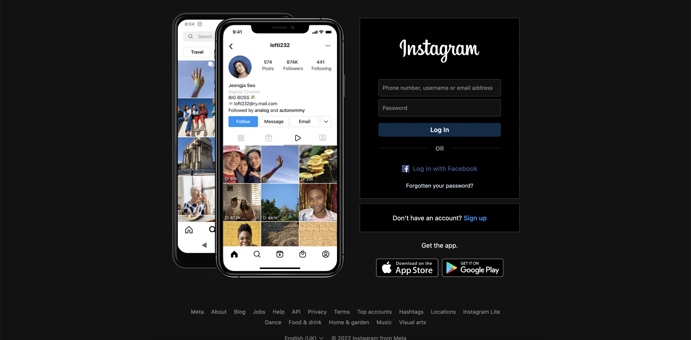
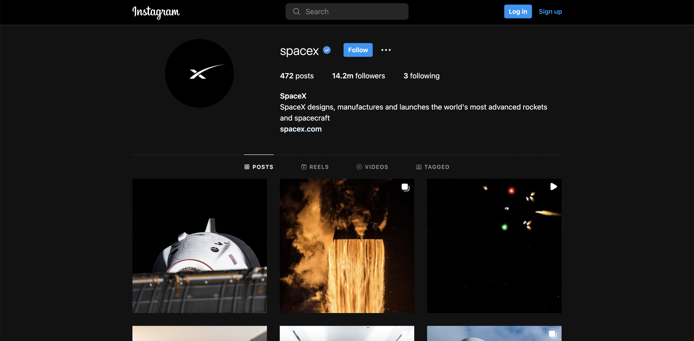

# Official Instagram Dark Mode for web

This user script activates the official dark mode that is included in Instagram.

The dark mode feature is usually only available on mobile devices, however
one can enable it by setting a URL parameter, which this user script will
do for you automatically.

## How to install

- Install the [Tampermonkey extension](https://www.tampermonkey.net/)
- Once Tampermonkey is installed, install this user script by clicking [here](https://raw.githubusercontent.com/matthewsanetra/ig-web-dark-mode/master/ig-web-dark-mode.user.js)

## Screenshots

